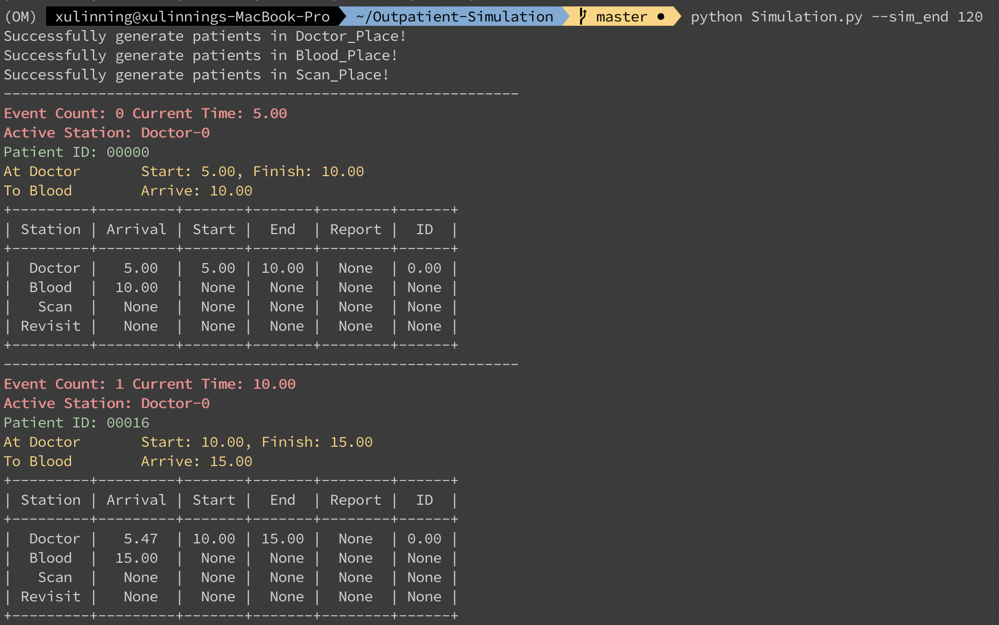
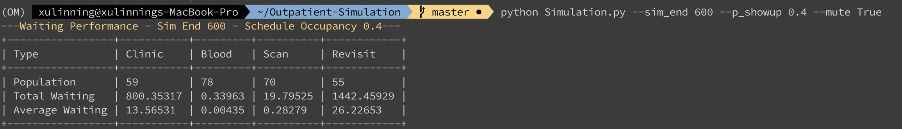
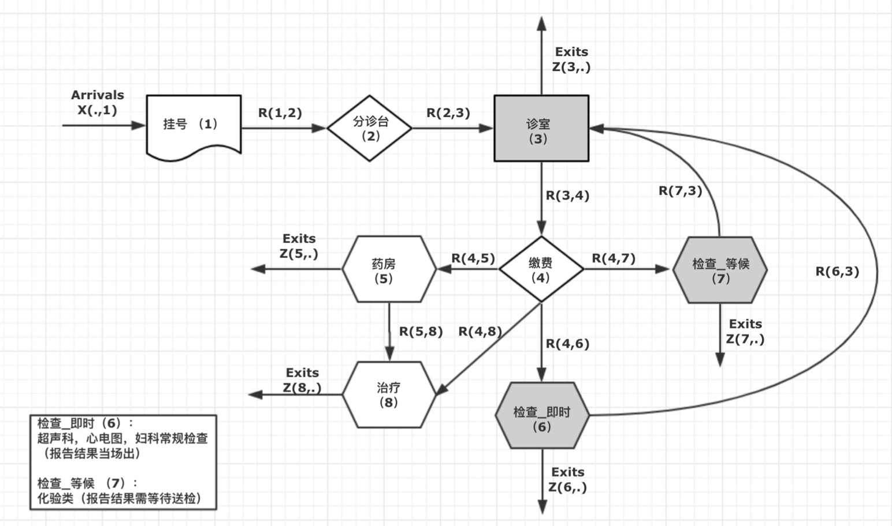

# Simulation Platform for Hospital Outpatient Scheduling #

#### 🥥 Sample Result ####
- Some tunning parameters can be specified via commands
- For example if you want to change the total horizon from default 720 mins to 600 mins

```
  python Simulation.py --sim_end 600
```

```
  python Simulation.py --sim_end 600 --p_showup 0.4 --mute True
```

- Check sample records (`Doctor.csv`, `Blood.csv`, `Scan.csv`) for event lists of each station.
#### 🥥 Source Code ###

#### 0) Simulation.py ####

- This file is the main file to simulate the whole process.
- Current argparser includes:
  ```python
  '--sim_end',            type = int,   default = 720     # simulation time horizon
  '--p_showup',           type = float, default = 4/5     # the probability a slot is occupied by a scheduled patient
  '--walk_in_rate',       type = float, default = 1/5     # walk in patient rate at clinic
  '--arrival_rate_blood', type = float, default = 1/15    # external arrival rate at blood station
  '--arrival_rate_scan',  type = float, default = 1/25    # external arrival rate at scan station
  '--num_node',           type = list,  default = [1,2,3] # server number at each station
  ```

- set **`MUTE = True`** to turn off detailed print out.
- set **`RECORD = True`** to write event records at three stations to **'./result/'** folder.

#### 1) utils.py ####

- This file includes all pre-determined environment setting parameters, global variables and functions,
- More complex environment ettings parameters, such as the transition probability and walk-time are also specified here.
- Some extra functions for beautiful visualizations are also included.

##### Global Variable: #####

- **`RAN_SEED`**: random seed, to reproduce
- **`Name_waiting_place`**, **`Red`**, **`Clear`** etc: Lookup table or string
- **`SAVE`**: list of list to save patient, **0-doctor 1-blood 2-scan**

##### Global Function / Class: #####

- **`Generator`**: class for generate some distribution
  It have 2 methods / functions, **`Exponential`** and **`Bernoulli`**.

- **`Ceil_Slot`**: Since doctor must operate in a SLOT.

- **`print_update`, `write_update`**: Show/Record time stamp and next active station.
- **`print_transit`, `write_transit`**: Show/Record event's details.
- **`write_info`**: Record the selected patient's updated info.

- **`Visualize`**: to visualize the element of SAVE.
  call (when your main environment is the Simulation.py) or you can call this code in “\_\_main\_\_” of Simulation.py:

#### 2) Patient.py ####

- This file determines the class **`Patient`**.

##### Class Variable: #####

- **`id`**: string, to identify patient
- **`revisit`**: bool, to identify whether he/she has seen the doctor
- **`time`**: numpy.narray, Record all kids of Time
  Row: 0-doctor, 1-blood, 2-scan, 3(namely -1)-revisit
  Col: 0-arrival_time(for queue), 1-begin_time, 2-finish_time, 3-report_time, 4-Doctor/Service ID
- **`check_list`**: list, operation list

##### Global Function: #####

- **`isRevisit`**: return self.revisit

#### 3) Waiting_Place.py ####

- This file is for modeling waiting place (queue).
- Waiting_place including blood place and scan place, and Doctor_Place is unique for clinic.
- The **`Waiting_Place`** and **`Doctor_Place`** has 3 main API:
  - **`add_patient(self, patient)`**:
    For blood_place or scan_place which has 1 queue, the API just lets the patient inqueue.
    For doctor_place, the API can let the patient inqueue scheduled queue (default) or revisited queue. 
    Since the walk-in is Exponential Distribution (memoryless), we can just generate one.
  - **`next_patient(self)`**:
    Just to return when the next patient appear. 
    If there is no person now, return the time when the expected next person appears (max is SIM_END).
    If available, return now.
  - **`send_patient(self)`**:
    Just return next patient.

#### 4) Serve_Place.py ####

- This file is for modeling serving process. 
- Includes **`Blood_Service`**, **`Scan_Service`**, and **`Doctor`**, 
- Their Constructor is for generating doctors or Service.
- The Serve_Place has only one API:
  - **`work(self, patient)`**: Just serve the patient, and return him/her.

#### 🍃 Reference Flow Chart ####
